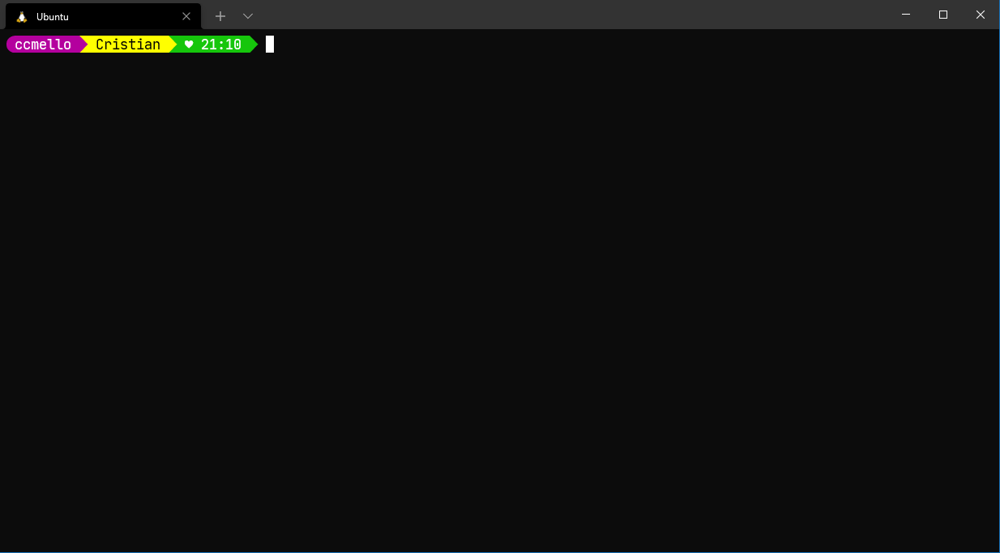

# myworkspace
My Workspace with WSL2 and Ubuntu 20.04 LTS

## Requirements

- Windows Terminal
- [JetBrainsMono NF Font](https://github.com/ryanoasis/nerd-fonts/releases/download/v2.1.0/JetBrainsMono.zip) installed
- WSL2
- Ubuntu 20.04 LTS installed via WSL2

## Setup

Only double click `setup.bat`.

## Fonts

Download **NERD Fonts**: [NERD Fonts](https://www.nerdfonts.com/font-downloads)

## OhMyPush Themes

[OhMyPush Themes](https://ohmyposh.dev/docs/themes)

## Example

